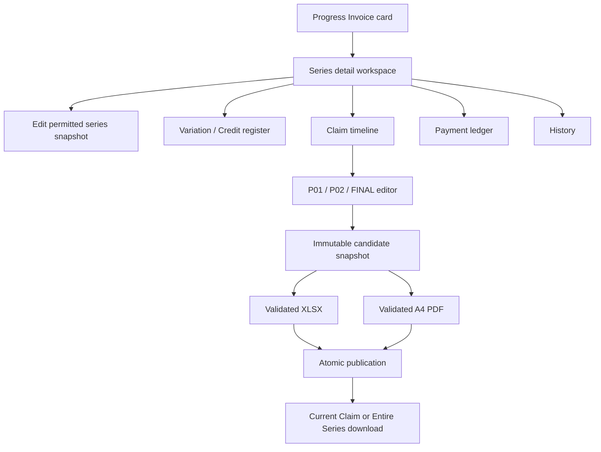

# Progress Invoice Series Detail and Official Documents Implementation Plan

> **For agentic workers:** REQUIRED SUB-SKILL: Use `superpowers:subagent-driven-development` (recommended) or `superpowers:executing-plans` to implement this plan task-by-task. Every worker and reviewer must use `gpt-5.6-sol` with `model_reasoning_effort = "high"`. Steps use checkbox (`- [ ]`) syntax for tracking.

**Goal:** Turn the current Progress Invoice dashboard and series shells into a reconciled series workspace where a user can open a card, correct permitted series data, safely Void records so they are archived from the default view, create and revise P01/P02/FINAL claims, manage Variations/Credits and receipts, and download matching official Tax Invoice XLSX/PDF files for the current claim or the entire series.

**Architecture:** Supabase remains the financial source of truth. All displayed totals are transactionally maintained from the Current revision-set manifest, approved adjustments, and eligible payment revisions; React never invents financial totals. A canonical immutable Claim Revision snapshot feeds a template-preserving XLSX renderer and an independent fixed-layout A4 PDF renderer. Both files must validate and be stored privately before an issued/revised Claim Revision can become Current. Claim/Series Void never fabricates a `$0.00` Tax Invoice; a Series-wide Void instead publishes a reviewed canonical empty Current manifest and preserves all prior Ready files in History.

**Tech Stack:** Next.js 16 App Router, React 19, strict TypeScript, Supabase/Postgres/RLS/Private Storage, Decimal.js with `ROUND_HALF_UP`, Zod, Vitest, pgTAP, `fflate@0.8.3`, `@xmldom/xmldom@0.9.10`, `pdf-lib@1.17.1`, `@pdf-lib/fontkit@1.1.1`, `pdfjs-dist@5.4.624`, and `@napi-rs/canvas@0.1.88` after the explicit dependency/font gates.

**Parent specifications:**

- `docs/superpowers/specs/2026-07-14-progress-invoices-design.md` — approved financial, revision, document, and security design.
- `docs/superpowers/specs/2026-07-17-progress-invoice-standalone-import-design.md` — Jobber Invoice is read once during import; no later Refresh/Sync UI.
- `docs/superpowers/specs/2026-07-17-progress-invoice-manual-creation-and-preview-date-design.md` — new series start from Jobber Invoice import or local Manual creation, not PBC Quote selection.

## Global Constraints

- This document is an implementation plan only. It does not authorize code execution, dependency installation, production migration, Storage mutation, environment changes, deployment, or production data correction.
- Existing Quote Jobber fetch, snapshot, Save & Sync, write-back files, routes, actions, scopes, and tests must remain unchanged.
- Progress Invoice Jobber access remains read-only. No Jobber invoice or payment mutation is permitted.
- A Jobber-import Series uses exactly one Jobber account/invoice identity; a Manual Series deliberately has none. Every Series has one accepted numbering base. After the first Claim draft reserves a number, the accepted base and any applicable Jobber identity are immutable.
- “Delete” means **set the existing record to `void` with a required reason and retained audit history**. `Archive` is only the default-view behavior of a Void record, not another database state. No hard-delete Action, RPC, direct table delete, or Storage deletion of a Ready official document will be added.
- `Base Contract Ex GST` is editable only while the Series has no Claim. After the first Claim exists, contract changes use Variation/Credit or an approved reconciliation flow.
- An Issued Claim keeps the same Claim and Tax Invoice identity. Editing creates an immutable new Revision; every previous Revision and Ready document remains available from History.
- Previous Progress Claims are prior issued Claim Revisions. They are never Jobber/manual receipts.
- `This Claim Amount` is **Inc GST**. The app derives Ex GST and GST. The alternative authoritative input is cumulative construction progress percentage.
- Retention is excluded.
- Money is transported as decimal strings and calculated with Decimal.js/Postgres numeric. Never use native `number`, `parseFloat`, or floating-point arithmetic for financial decisions.
- Official XLSX/PDF files must come from one immutable snapshot and match on Tax Invoice number, dates, recipient, Claim order, Ex GST, GST, and Inc GST to the cent.
- The original customer XLSX/PDF, customer data, bank details, tokens, raw Jobber responses, and real production fixtures must not enter Git or logs.
- Every Series/Claim/Adjustment/Payment/document state mutation uses Zod validation, `requireAllowedUser()`, `expectedVersion`, a UUID correlation/idempotency key, a fixed-search-path transactional RPC, and a safe `ActionResult`. The singleton supplier profile retains its existing optimistic-version path, while bounded template registration is idempotent under an authenticated source-hash lock because the caller is intentionally forbidden from supplying version/path/hash/idempotency metadata.
- All new `SECURITY DEFINER` functions revoke `PUBLIC`, `anon`, and unintended roles explicitly, check `auth.uid()`, and grant only the required role. Do not rely on automatic Data API exposure.
- Development and DB verification must use the local Docker Supabase project. The current `.env.local` targets Production, so every mutating command must first pass a project-ref/URL guard and fail closed when Production is selected.
- Do not update `docs/DECISIONS.md` or `docs/BACKLOG.md` without separate user approval.

---

## Current-State Audit

### Implemented now

- Core Progress Invoice tables, RLS, immutable-row guards, and SELECT-only authenticated access.
- Dashboard, Jobber-first/Manual series creation, one-time Jobber invoice/payment import, series read/update RPCs, and Adjustment mutation RPCs.
- Decimal.js adjusted-contract and Claim calculations.
- Imported Jobber payment identities/revisions and cached receipt totals.
- `get_progress_invoice_series`, `update_progress_invoice_series`, and Variation/Credit create/update/approve/supersede service/action boundaries.

### Missing now

- `/progress-invoices/[seriesId]` and Claim detail routes.
- A complete workspace DTO containing adjustments, claims, payments, documents, and safe audit history.
- Series Void RPC, default-view archiving, and post-Claim base-contract lock.
- Manual payment/replace/void/match/undo RPCs and UI.
- Claim number reservation, draft save, issue/revise/void, Current revision-set publication, and claim editor.
- Normalized workbook/font assets, XLSX/PDF renderers and validators.
- Private document/template buckets, document orchestration, signed download route, and download UI.

### Why the current dashboard amounts look wrong

The current calculations are internally consistent, but the two visible rows are incomplete QA/verification Series rather than completed Progress Invoice ledgers.

| Display | Exact current source | Interpretation |
|---|---|---|
| Adjusted Contract Ex GST | Sample-shell base + Jobber-import verification base | The visible total is the exact sum of the two stored bases, not a completed official-series total. |
| Claimed Inc GST | No Issued Claim exists in either Series | Correctly zero until Claim/Revisions/Current Revision Set data exists. |
| Received Inc GST | One eligible imported Jobber payment exists only in the verification Series | Correctly independent from Claims. |
| Outstanding Inc GST | `max(Claimed - Received, 0)` | Correctly zero while Claimed is zero. |
| Credit Balance Inc GST | `max(Received - Claimed, 0)` | The amount exists in the read model but is currently hidden except for its badge. |
| Progress | `Claimed Inc GST / Adjusted Contract Inc GST` | Correctly zero while no Claim is Issued. |

Additional defects to correct before Claim issuance:

- The sample-shell Series contains only its base plus one draft Variation; it has no Claim/Revisions/Revision Sets/Payments.
- The Jobber-import verification Series contains a user-entered placeholder base and one imported receipt but no Claim. Its Jobber subtotal is comparison-only and must not replace the base automatically.
- Exact live Series IDs, commercial amounts, payment dates, and proposed corrections belong only in the private, untracked correction preview from Task 13.
- The header totals aggregate only the visible page, not the full filtered result set.
- `current_credit_balance` is not carried through the dashboard RPC/DTO.
- A zero-Claim/zero-Receipt Series is labelled `Unpaid`; the UI should say `No claims issued`.
- Existing read-model functions sum `claim.current_revision_id` directly. Before Claims are enabled, all claimed totals must instead be derived from the single Current revision-set manifest.

### Supplied workbook regression values

The sanitized test fixture must preserve these exact values without retaining customer identity:

| Stage | Required financial result |
|---|---:|
| P01 current Claim Inc GST | `18,942.55` |
| P01 Variation increment Ex GST | `19,714.68` |
| P02 additional Variation Ex GST | `1,997.86` |
| P02 cumulative approved Variations Ex GST | `21,712.54` |
| P02 adjusted contract Ex GST / Inc GST | `38,933.04` / `42,826.34` |
| P02 cumulative target | `90%` / `38,543.71` Inc GST |
| P02 current Claim / remaining | `19,601.16` / `4,282.63` Inc GST |
| FINAL additional Variation Ex GST | `574.04` |
| FINAL adjusted contract Ex GST / Inc GST | `39,507.08` / `43,457.79` |
| FINAL current Claim / remaining | `4,914.08` / `0.00` Inc GST |

The workbook’s old `Paid` labels are not evidence of receipt. A workbook-only regression fixture therefore ends at Claimed `43,457.79`, Received `0.00`, Outstanding `43,457.79`, Progress `100%`.

---

## Considered Approaches

### Recommended: staged domain-first workspace and dual-rendered documents

First make the ledger and state transitions correct, then add Claim publication and immutable documents, then correct live sample data through the same public commands. This takes more steps but prevents the dashboard, detail page, XLSX, and PDF from using different definitions.

### Rejected: link the card and patch visible amounts only

This is quick but leaves no Claim source of truth, no edit history, no safe deletion, and no official document pipeline. It would hide incomplete data instead of correcting it.

### Rejected: generate PDF from browser print and reconstruct Excel independently

This is operationally simple but cannot reliably preserve the supplied workbook relationships/layout or guarantee that XLSX and PDF match to the cent. It also makes issued revisions and whole-series bundles difficult to validate atomically.

---

## Target User Flow



The detail page shows the imported Jobber observation as read-only comparison evidence. It does not expose Refresh, Sync, polling, or scheduled import controls.

## Financial Display Contract

```text
Adjusted Contract Ex GST = Base Contract Ex GST
                           + Approved Variations Ex GST
                           - Approved Credits Ex GST

Claimed Inc GST = Sum of issued revisions selected by the Current revision-set manifest

Received Inc GST = Sum of eligible active Jobber/manual receipt effects

Outstanding Inc GST = max(Claimed Inc GST - Received Inc GST, 0)

Credit Balance Inc GST = max(Received Inc GST - Claimed Inc GST, 0)

Unclaimed Inc GST = Adjusted Contract Inc GST - Claimed Inc GST

Progress % = Claimed Inc GST / Adjusted Contract Inc GST * 100
```

The default dashboard filter excludes Void rows. An explicit Void filter matches only Void rows. Header totals always aggregate the exact `matching` set before pagination, so they cover all rows selected by the active filter rather than only the visible page. Every figure carries its GST basis in the label. A Series with `currentManifestClaimCount === 0` displays `No claims issued` even when Draft Claims or a receipt/Credit Balance exist; `Unpaid` requires at least one Claim selected by the Current manifest and a positive receivable.

## Edit and Void Matrix

| Entity/state | Permitted action | Required result |
|---|---|---|
| Draft Series, no Claim | Edit base/recipient/site/reference/description; Void with reason | Versioned write and audit event |
| Draft Series, Draft Claims only | Void Series with reason | Draft Claims and Series become Void in one transaction; reserved numbers/revisions remain |
| Series after any Claim exists | Edit future recipient/site/reference/description defaults | Base, numbering base, and any applicable Jobber identity remain locked |
| Contract change after Claim | Approved Variation/Credit or reconciliation | No direct base overwrite |
| Draft Adjustment | Edit/reject/approve | Approved content becomes immutable |
| Approved Adjustment | Superseding correction with reason | Old row retained |
| Draft Claim | Edit or Void | Number is never reused |
| Issued Claim | Revise same identity or Void with reason | Prior Revision/documents retained; cascade/tax gate applies |
| Series with Issued Claims | Propose Series-wide Void with reason | Tax review passes before the canonical empty Current Set/Claims/Series switch atomically; no synthetic Void invoice |
| Jobber Payment | Read-only | No PBC or Jobber mutation |
| Manual Payment | Create; replace by revision; Void with reason | History retained |
| Void Series | Read/history and explicit historical downloads only | Hidden from default dashboard; current Claim/Series downloads disabled; never hard-deleted |

---

## Approval Gates

| Gate | Approval/evidence owner | Required evidence | Blocks until closed |
|---|---|---|---|
| G2 — Document dependencies | User approves exact package versions after engineering review | Licence, platform/runtime compatibility, install size, clean high-severity audit | Package installation and renderer implementation |
| G3 — Embedded font | User approves the reviewed Carlito distribution | Upstream source, OFL text, Regular/Bold hashes, redistribution evidence | Final PDF rendering and visual baseline |
| G4 — Local platform | Engineering verification; no Production authority | Reproducible local Docker config, full migration reset, pgTAP/RLS/Storage E2E, fail-closed Production guard | Any release claim or Production migration proposal |
| G5 — Tax/accounting policy | Accountant evidence recorded and user accepts it | Required Tax Invoice fields, Issued revision/Void treatment, when an external Adjustment Note reference is mandatory, reviewed XLSX/PDF evidence bundle | Enabling official Issue/revise/Void/document generation/download in Production |
| G6 — Production rollout | User gives separate approval for each mutation | Exact migration list, bucket/policy diff, environment/feature-flag diff, deploy artifact, template activation evidence, and any data-correction before/after report | Production DB/Storage/env/deploy/template activation/data correction |

G2/G3 do not imply G5/G6. G5 does not authorize a Production mutation. A prior generic DB permission does not substitute for the exact G6 approvals above.

---

## File and Module Map

### Existing files to extend

- `app/(app)/progress-invoices/page.tsx`
- `components/progress-invoices/progress-invoice-dashboard.tsx`
- `components/progress-invoices/progress-invoice-series-fields.tsx`
- `app/styles/components.css`
- `lib/progress-invoices/calculation.ts`
- `lib/progress-invoices/repository.ts`
- `lib/progress-invoices/series-service.ts`
- `lib/progress-invoices/adjustment-service.ts`
- `lib/progress-invoices/validators.ts`
- `lib/actions/progress-invoice-series.ts`
- `lib/actions/progress-invoice-adjustments.ts`
- `lib/supabase/types.ts`
- `supabase/tests/progress_invoices_test.sql`

### New application modules

- `app/(app)/progress-invoices/[seriesId]/page.tsx`
- `app/(app)/progress-invoices/[seriesId]/loading.tsx`
- `app/(app)/progress-invoices/[seriesId]/claims/new/page.tsx`
- `app/(app)/progress-invoices/[seriesId]/claims/[claimId]/page.tsx`
- `app/(app)/settings/invoice/page.tsx`
- `app/(app)/settings/invoice/loading.tsx`
- `components/progress-invoices/invoice-profile-form.tsx`
- `components/progress-invoices/template-registration-panel.tsx`
- `components/progress-invoices/series-detail.tsx`
- `components/progress-invoices/series-edit-form.tsx`
- `components/progress-invoices/series-void-dialog.tsx`
- `components/progress-invoices/adjustment-register.tsx`
- `components/progress-invoices/claim-timeline.tsx`
- `components/progress-invoices/claim-editor.tsx`
- `components/progress-invoices/payment-ledger.tsx`
- `components/progress-invoices/history-panel.tsx`
- `components/progress-invoices/tax-invoice-preview.tsx`
- `components/progress-invoices/document-download-menu.tsx`
- `components/progress-invoices/tax-review-panel.tsx`
- `lib/progress-invoices/workspace-service.ts`
- `lib/progress-invoices/payment-service.ts`
- `lib/progress-invoices/claim-service.ts`
- `lib/progress-invoices/revision-set-service.ts`
- `lib/progress-invoices/tax-review-service.ts`
- `lib/progress-invoices/feature-flags.ts`
- `lib/actions/progress-invoice-payments.ts`
- `lib/actions/progress-invoice-claims.ts`
- `lib/actions/progress-invoice-tax-review.ts`
- `lib/actions/progress-invoice-documents.ts`
- `app/api/progress-invoices/documents/[documentId]/route.ts`

### New document modules

- `lib/progress-invoices/documents/types.ts`
- `lib/progress-invoices/documents/template-manifest.ts`
- `lib/progress-invoices/documents/ooxml-archive-guard.ts`
- `lib/progress-invoices/documents/ooxml-cell-writer.ts`
- `lib/progress-invoices/documents/snapshot-builder.ts`
- `lib/progress-invoices/documents/filenames.ts`
- `lib/progress-invoices/documents/xlsx-renderer.ts`
- `lib/progress-invoices/documents/xlsx-validator.ts`
- `lib/progress-invoices/documents/pdf-layout.ts`
- `lib/progress-invoices/documents/pdf-renderer.ts`
- `lib/progress-invoices/documents/pdf-validator.ts`
- `lib/progress-invoices/documents/cross-format-validator.ts`
- `lib/progress-invoices/documents/template-registration.ts`
- `lib/progress-invoices/documents/document-storage.ts`
- `lib/progress-invoices/documents/document-orchestrator.ts`
- `lib/progress-invoices/documents/download-service.ts`
- `assets/progress-invoices/template-v1.xlsx`
- `assets/progress-invoices/template-v1.manifest.json`
- `assets/progress-invoices/logo.png`
- `assets/progress-invoices/fonts/Carlito-Regular.ttf`
- `assets/progress-invoices/fonts/Carlito-Bold.ttf`

The original customer workbook is never copied into `assets/`. `template-v1.xlsx` is a separately verified, cleared, formula-free normalized master.

### Migration rule

Every forward migration begins by running the Task 0 local wrapper with `migration new` and the exact migration name specified in its task, then using the CLI-returned path. Later snippets that show `npx.cmd supabase` name the canonical Supabase operation; on this machine execute the same arguments through `scripts/run-local-supabase.ps1`. Do not add the old uncreated planned filenames `20260714231300` through `20260714232000` after newer Production migrations. Before committing any migration task, reset/test the local Docker database and regenerate `lib/supabase/types.ts` from `--local`; never generate types from or apply the migration to the linked Production project during implementation.

```powershell
powershell -NoProfile -File scripts/run-local-supabase.ps1 db reset --local
powershell -NoProfile -File scripts/run-local-supabase.ps1 test db --local supabase/tests/progress_invoices_test.sql
powershell -NoProfile -File scripts/run-local-supabase.ps1 gen types --local --lang typescript --schema public | Out-File -LiteralPath lib/supabase/types.ts -Encoding utf8
```

---

### Task 0: Freeze the validated creation fix and isolate execution

**Files:** Current dirty Progress Invoice creation/import/dashboard files; this plan; then local-only Supabase runner/config files in the isolated worktree. No feature code is mixed into the baseline commits.

**Interfaces:**
- Consumes: the validated duplicate-safe Jobber import behavior.
- Produces: clean baseline/plan commits, an isolated `codex/progress-invoice-series-detail-documents` worktree, and a reproducible local-Docker-only command boundary.

- [ ] **Step 1: Confirm the current branch and dirty scope**

Run:

```powershell
git branch --show-current
git status --short
git diff --check
```

Expected: branch `codex/progress-invoice-standalone-import`; only the already-reviewed creation/import/dashboard regression files are modified; diff check succeeds.

- [ ] **Step 2: Re-run the verified baseline**

Run:

```powershell
npm.cmd run typecheck
npm.cmd run test:run
npm.cmd exec -- eslint components/progress-invoices lib/progress-invoices lib/actions/progress-invoice-jobber.ts tests/progress-invoice-actions.test.ts tests/progress-invoice-dashboard-ui.test.tsx tests/progress-invoice-jobber-refresh.test.ts tests/progress-invoice-repository.test.ts tests/progress-invoice-standalone-import.test.ts tests/progress-invoice-standalone-ui.test.tsx
```

Expected: current verified baseline remains green before any new scope is mixed in.

- [ ] **Step 3: Commit the current fix only after the user authorizes execution**

Stage only the reviewed files shown by Step 1 and commit:

```powershell
git commit -m "fix: handle duplicate progress invoice imports"
```

- [ ] **Step 4: Commit this reviewed execution plan**

After the user approves this plan, commit it separately so the implementation worktree contains its checklist:

```powershell
git add docs/superpowers/plans/2026-07-18-progress-invoice-series-detail-and-documents.md
git commit -m "docs: plan progress invoice series workspace"
```

- [ ] **Step 5: Create the isolated implementation worktree**

Use `superpowers:using-git-worktrees`, create branch `codex/progress-invoice-series-detail-documents`, and verify it starts from the Step 4 plan commit with a clean status.

- [ ] **Step 6: Make the existing local Docker stack reproducible without the broken global CLI profile**

The current machine has a healthy `progress-invoice-series` Docker stack but the repository lacks `supabase/config.toml`, and the legacy global Supabase profile selector currently fails with `Unsupported Config Type`. Do not edit or delete that global profile and do not relink the repository to Production.

In the isolated worktree, generate/commit a non-secret `supabase/config.toml` whose project ID matches the local stack, plus `scripts/run-local-supabase.ps1` and a focused test. The wrapper uses an isolated ignored CLI home, allows only `migration new`, local start/status/reset/test/type-generation operations, rejects remote/link/push/secrets/deploy commands, and redacts start/status secrets. Replace every later `npx.cmd supabase ...` instruction with the equivalent wrapper invocation while this known profile incompatibility remains. Prove the wrapper selects only Docker containers labelled `com.supabase.cli.project=progress-invoice-series`.

- [ ] **Step 7: Bind the implementation worktree to local Docker only**

Do not copy the current Production-pointing `.env.local`. Populate the ignored worktree environment through the local wrapper’s non-logging setup path and fail closed unless `NEXT_PUBLIC_SUPABASE_URL` resolves to `127.0.0.1:54321` and the database endpoint resolves to the local Docker port. The guard prints only `LOCAL_OK` or a safe refusal—never keys or URLs. Run it before every browser QA, seed, Action/RPC mutation, and Storage test. Commit only the non-secret config/wrapper/test, never the generated environment.

### Task 1: Lock the financial semantics with sanitized regressions

**Files:**
- Create: `tests/fixtures/progress-invoices/sample-financials.ts`
- Modify: `tests/progress-invoice-calculation.test.ts`

**Interfaces:**
- Produces: `SAMPLE_PROGRESS_SERIES` with base, three Variation increments, P01/P02/FINAL, and zero inferred receipts.
- Consumes: `calculateProgressClaim()` only; the DB read-model RED test starts and finishes in Task 2.

- [ ] **Step 1: Add the sanitized fixture**

```ts
export const SAMPLE_PROGRESS_SERIES = {
  baseContractExGst: '17220.50',
  variationIncrementsExGst: ['19714.68', '1997.86', '574.04'],
  p01IncGst: '18942.55',
  p02CumulativePercentage: '90.000000',
  p02CurrentIncGst: '19601.16',
  finalCurrentIncGst: '4914.08',
  finalAdjustedExGst: '39507.08',
  finalClaimedIncGst: '43457.79',
  inferredReceiptsIncGst: '0.00',
} as const
```

Do not include the customer name, addresses, invoice IDs, bank details, or original files.

- [ ] **Step 2: Write RED tests for the exact P01/P02/FINAL chain**

Assert the values in the audit table, including P02 90%, component-level GST rounding, FINAL residual, and no receipt inferred from the workbook.

- [ ] **Step 3: Run the sanitized calculation regression**

```powershell
npm.cmd run test:run -- tests/progress-invoice-calculation.test.ts
```

Expected: the exact sanitized P01/P02/FINAL chain is GREEN before commit. No intentionally failing test is committed.

- [ ] **Step 4: Commit the fixture/tests without changing Production data**

```powershell
git add tests/fixtures/progress-invoices/sample-financials.ts tests/progress-invoice-calculation.test.ts
git commit -m "test: lock progress invoice financial semantics"
```

### Task 2: Correct the manifest read model, dashboard summaries, statuses, and card navigation

**Files:**
- Modify: `app/(app)/progress-invoices/page.tsx`
- Modify: `components/progress-invoices/progress-invoice-dashboard.tsx`
- Modify: `app/styles/components.css`
- Modify: `lib/progress-invoices/repository.ts`
- Modify: `lib/progress-invoices/series-service.ts`
- Modify: `tests/progress-invoice-dashboard-ui.test.tsx`
- Modify: `tests/progress-invoice-series-service.test.ts`
- Create: `tests/progress-invoice-read-model-contract.test.ts`
- Create via CLI: migration from `npx.cmd supabase migration new extend_progress_invoice_dashboard_summary`
- Modify: `supabase/tests/progress_invoices_test.sql`
- Regenerate: `lib/supabase/types.ts`

**Interfaces:**

```ts
export interface ProgressInvoiceDashboardSummary {
  adjustedContractExGst: string
  claimedIncGst: string
  receivedIncGst: string
  outstandingIncGst: string
  creditBalanceIncGst: string
  unclaimedIncGst: string
}

export type ProgressInvoiceDisplayPaymentState =
  | 'no_claims'
  | 'unpaid'
  | 'part_paid'
  | 'paid'
  | 'overdue'
  | 'credit_balance'
```

- [ ] **Step 1: Write RED Current-manifest and dashboard contract tests**

Create two revision sets selecting different revisions of the same Claim and prove cached claimed/progress totals follow only the one Current manifest, not `claim.current_revision_id`. Also cover full-filter summary vs page items, default non-void filter, explicit Void-only filter, per-card adjusted Ex GST, Claim/Receipt/Outstanding/Credit/Unclaimed Inc GST, `currentManifestClaimCount === 0` rendering `No claims issued` with Draft Claims and/or a positive Credit Balance, mixed GST labels, server-derived overdue state as of the `Australia/Sydney` calendar date, and complete card keyboard navigation to `/progress-invoices/{seriesId}`.

Run these focused tests once and record the expected RED from the current pointer-based SQL. Do not commit or proceed until Step 5 returns the entire suite to GREEN.

- [ ] **Step 2: Generate the forward migration**

```powershell
npx.cmd supabase migration new extend_progress_invoice_dashboard_summary
```

Record the exact returned path in the task log. Forward-replace both the public wrapper `progress_recalculate_series_read_model(UUID)` and the actual actor-aware implementation `progress_recalculate_series_read_model_as(UUID, UUID)`, then prove every direct caller uses the same manifest logic. Issued totals come only from the ordered revisions in the single Current revision-set manifest; no Current set means zero issued Claims. Preserve independent eligible Jobber/manual receipt effects, Sydney-date FIFO overdue allocation, and part-paid/paid/credit state. Then update the list RPC so its default predicate excludes Void, an explicit Void filter matches only Void, and summary fields aggregate the complete filtered `matching` CTE before pagination. Return `current_credit_balance`, `current_manifest_claim_count`, and current invoice/reference display fields for each item.

- [ ] **Step 3: Implement DTO parsing and service mapping**

Reject missing/invalid decimal strings as `PROGRESS_RESPONSE_INVALID`; never fall back to browser arithmetic. Map `currentManifestClaimCount === 0` to `no_claims` without rewriting historical payment rows. Always render the independent Credit Balance amount, including when `no_claims` is the display state.

- [ ] **Step 4: Implement accessible card navigation**

Create one primary `IntentLink` region per card. Keep secondary actions outside that link so no nested interactive element exists. Pointer click, Enter, and keyboard focus must all open the Series detail route.

- [ ] **Step 5: Run GREEN and local DB verification**

```powershell
npm.cmd run test:run -- tests/progress-invoice-dashboard-ui.test.tsx tests/progress-invoice-series-service.test.ts tests/progress-invoice-repository.test.ts
npx.cmd supabase db reset --local
npx.cmd supabase test db --local supabase/tests/progress_invoices_test.sql
npm.cmd run typecheck
```

Run `EXPLAIN (ANALYZE, BUFFERS)` against representative filtered fixtures without logging customer text; add only the indexes justified by the plan and prove the RPC returns one bounded page plus one aggregate object rather than materializing all rows in the application.

- [ ] **Step 6: Regenerate types and commit**

```powershell
npx.cmd supabase gen types --local --lang typescript --schema public | Out-File -LiteralPath lib/supabase/types.ts -Encoding utf8
git add -- 'app/(app)/progress-invoices/page.tsx' components/progress-invoices/progress-invoice-dashboard.tsx app/styles/components.css lib/progress-invoices/repository.ts lib/progress-invoices/series-service.ts tests/progress-invoice-dashboard-ui.test.tsx tests/progress-invoice-series-service.test.ts tests/progress-invoice-repository.test.ts tests/progress-invoice-read-model-contract.test.ts supabase/migrations supabase/tests/progress_invoices_test.sql lib/supabase/types.ts
git commit -m "fix: reconcile progress invoice dashboard totals"
```

### Task 3: Add the bounded Series workspace read model and detail route

**Files:**
- Create via CLI: migration from `npx.cmd supabase migration new add_progress_invoice_workspace_reads`
- Create: `lib/progress-invoices/workspace-service.ts`
- Modify: `lib/progress-invoices/repository.ts`
- Modify: `lib/actions/progress-invoice-series.ts`
- Create: `app/(app)/progress-invoices/[seriesId]/page.tsx`
- Create: `app/(app)/progress-invoices/[seriesId]/loading.tsx`
- Create: `components/progress-invoices/series-detail.tsx`
- Create: `components/progress-invoices/claim-timeline.tsx`
- Create: `components/progress-invoices/payment-ledger.tsx`
- Create: `components/progress-invoices/history-panel.tsx`
- Modify: `app/styles/components.css`
- Create: `tests/progress-invoice-workspace-service.test.ts`
- Create: `tests/progress-invoice-series-ui.test.tsx`
- Modify: `supabase/tests/progress_invoices_test.sql`

**Interfaces:**

```ts
export interface ProgressInvoiceSeriesWorkspaceDto {
  series: ProgressInvoiceSeriesDetail
  summary: {
    adjustedExGst: string
    adjustedGst: string
    adjustedIncGst: string
    claimedIncGst: string
    receivedIncGst: string
    outstandingIncGst: string
    creditBalanceIncGst: string
    unclaimedIncGst: string
    cumulativePercentage: string
  }
  importedJobberObservation: ProgressInvoiceImportedObservationDto | null
  currentRevisionSet: {
    id: string
    revisionManifestHash: string
    currentManifestClaimCount: number
    currentClaimRevisionId: string | null
  } | null
  adjustments: readonly ProgressInvoiceAdjustmentDto[]
  claims: readonly ProgressInvoiceClaimListItemDto[]
  payments: readonly ProgressInvoicePaymentListItemDto[]
  readyDocuments: readonly ProgressInvoiceDocumentListItemDto[]
  recentEvents: readonly ProgressInvoiceSafeEventDto[]
  history: { nextCursor: string | null }
  capabilities: {
    canEditSeries: boolean
    canEditBaseContract: boolean
    canVoidSeriesDirectly: boolean
    requiresClaimVoidWorkflow: boolean
    canCreateClaim: boolean
    canDownloadCurrent: boolean
    canDownloadHistorical: boolean
  }
}
```

- [ ] **Step 1: Write RED repository/service tests**

Assert exact decimal preservation, exact Current-set/manifest/current-Claim metadata from the manifest read model, bounded arrays, safe event payloads, no raw Jobber response, no bank details in event JSON, correct current-vs-historical download capability flags, and independent section errors mapped without hiding local data.

- [ ] **Step 2: Generate and implement read RPCs**

```powershell
npx.cmd supabase migration new add_progress_invoice_workspace_reads
```

Implement authenticated `get_progress_invoice_workspace(payload jsonb)` plus cursor-based `list_progress_invoice_history(payload jsonb)`. Both verify `auth.uid()`, validate exact keys/UUIDs/limits, use a fixed empty search path, revoke default execute, and explicitly grant `authenticated` only.

- [ ] **Step 3: Implement the Server Action and page**

```ts
export async function getProgressInvoiceSeriesWorkspace(
  seriesId: unknown,
): Promise<ActionResult<ProgressInvoiceSeriesWorkspaceDto | null>>
```

Validate UUID, authorize before the RPC, use `notFound()` for a missing Series, and render financial summary server-side. Client islands own only mutation forms.

- [ ] **Step 4: Render read-only detail sections**

Render Summary, Imported Jobber observation, Recipient/Site, Adjustments, Claim timeline, Payment ledger, Documents, and History. The Jobber card says `Imported on …` and has no Refresh/Sync control.

- [ ] **Step 5: Run GREEN, accessibility, and 404 tests**

```powershell
npm.cmd run test:run -- tests/progress-invoice-workspace-service.test.ts tests/progress-invoice-series-ui.test.tsx tests/progress-invoice-actions.test.ts
npx.cmd supabase test db --local supabase/tests/progress_invoices_test.sql
npm.cmd run typecheck
```

- [ ] **Step 6: Commit**

```powershell
git add -- 'app/(app)/progress-invoices/[seriesId]' components/progress-invoices/series-detail.tsx components/progress-invoices/claim-timeline.tsx components/progress-invoices/payment-ledger.tsx components/progress-invoices/history-panel.tsx app/styles/components.css lib/progress-invoices/workspace-service.ts lib/progress-invoices/repository.ts lib/actions/progress-invoice-series.ts tests/progress-invoice-workspace-service.test.ts tests/progress-invoice-series-ui.test.tsx supabase/migrations supabase/tests/progress_invoices_test.sql lib/supabase/types.ts
git commit -m "feat: add progress invoice series workspace"
```

### Task 3A: Add Invoice Profile Settings and enforce profile readiness

**Files:**
- Create: `app/(app)/settings/invoice/page.tsx`
- Create: `app/(app)/settings/invoice/loading.tsx`
- Create: `components/progress-invoices/invoice-profile-form.tsx`
- Modify: `app/(app)/settings/page.tsx`
- Modify: `components/progress-invoices/series-detail.tsx`
- Modify: `lib/progress-invoices/workspace-service.ts`
- Modify: `lib/progress-invoices/validators.ts`
- Create via CLI: migration from `npx.cmd supabase migration new harden_progress_invoice_profile_validation`
- Modify: `supabase/tests/progress_invoices_test.sql`
- Reuse: `getBusinessInvoiceProfile` / `saveBusinessInvoiceProfile`
- Create: `tests/progress-invoice-settings-ui.test.tsx`
- Modify: `tests/progress-invoice-workspace-service.test.ts`

**Interfaces:**
- Produces: a complete supplier/ABN/contact/bank/GST/timezone/payment-term profile used only as the source for future immutable Claim snapshots.
- Produces: `canCreateClaim=false` plus a `/settings/invoice` setup link when the profile is missing or invalid.

- [ ] **Step 1: Write RED settings/readiness tests**

Cover legal/trading names, ABN checksum/format, contractor licence, address, contact, bank details, fixed GST `0.10`, fixed timezone `Australia/Sydney`, payment terms, optimistic conflict, validation summary, and profile-missing Claim prevention. Assert bank values never enter browser storage, URL/search params, analytics, console output, or safe event payloads.

- [ ] **Step 2: Enforce the same ABN/profile rules at both boundaries**

```powershell
npx.cmd supabase migration new harden_progress_invoice_profile_validation
```

Normalize spaces, require eleven digits, and implement the Australian ABN checksum in the shared Zod validator and forward-replaced profile RPC/helper so a direct authenticated RPC cannot bypass the Action. Keep GST/timezone fixed and payment terms bounded `0..365`. Add pgTAP parity cases for valid/invalid ABNs.

- [ ] **Step 3: Build the dedicated Settings surface**

Reuse the existing validated Actions; do not add a duplicate write path. Add a Settings link/card without moving Progress Invoices under Inventory. The server loads the profile, the client island posts only the form, and successful saves re-read the server DTO.

- [ ] **Step 4: Enforce readiness in the workspace and Claim entry point**

The detail page may still be read/edited without a profile, but Claim creation stays disabled with a precise setup message. Later Draft creation snapshots the current profile version; later Settings edits never alter existing Claim Revisions.

- [ ] **Step 5: Run GREEN and commit**

```powershell
npm.cmd run test:run -- tests/progress-invoice-settings-ui.test.tsx tests/progress-invoice-workspace-service.test.ts tests/progress-invoice-actions.test.ts tests/progress-invoice-validators.test.ts
npx.cmd supabase test db --local supabase/tests/progress_invoices_test.sql
npm.cmd run typecheck
git add -- 'app/(app)/settings/invoice' 'app/(app)/settings/page.tsx' components/progress-invoices/invoice-profile-form.tsx components/progress-invoices/series-detail.tsx lib/progress-invoices/workspace-service.ts lib/progress-invoices/validators.ts tests/progress-invoice-settings-ui.test.tsx tests/progress-invoice-workspace-service.test.ts supabase/migrations supabase/tests/progress_invoices_test.sql lib/supabase/types.ts
git commit -m "feat: configure progress invoice supplier profile"
```

### Task 4: Implement permitted Series edits and safe Void

**Files:**
- Create via CLI: migration from `npx.cmd supabase migration new harden_progress_invoice_series_lifecycle`
- Modify: `lib/progress-invoices/validators.ts`
- Modify: `lib/progress-invoices/repository.ts`
- Modify: `lib/progress-invoices/series-service.ts`
- Modify: `lib/actions/progress-invoice-series.ts`
- Create: `components/progress-invoices/series-edit-form.tsx`
- Create: `components/progress-invoices/series-void-dialog.tsx`
- Modify: `components/progress-invoices/series-detail.tsx`
- Create: `tests/progress-invoice-series-lifecycle.test.ts`
- Modify: `tests/progress-invoice-series-ui.test.tsx`
- Modify: `supabase/tests/progress_invoices_test.sql`

**Interfaces:**

```ts
export interface VoidProgressInvoiceSeriesInput {
  seriesId: string
  expectedSeriesVersion: number
  expectedCurrentRevisionSetId: string | null
  expectedCurrentManifestHash: string | null
  preparedRevisionSetId?: string | null
  reason: string
  correlationKey: string
}

export interface ProgressInvoiceSeriesVoidResult {
  seriesId: string
  version: number
  mode: 'direct' | 'pending_tax_review' | 'published'
  revisionSetId: string | null
}

export async function voidProgressInvoiceSeries(
  input: unknown,
): Promise<ActionResult<ProgressInvoiceSeriesVoidResult>>
```

- [ ] **Step 1: Write RED lifecycle tests**

Cover edit before first Claim, base lock after any Claim exists, Void-series edit rejection, immutable source/numbering base/applicable Jobber identity, Manual-Series absence of Jobber identity, version conflict current DTO, exact retry idempotency, required Void reason, and absence of every hard-delete code path. Add three lifecycle cases: no Claim, Draft Claims only, and at least one Issued Claim. Prove a numbering base is released only when a Claim-free Series is voided; once any Claim has ever existed, including a Draft later voided, that base remains permanently unavailable to every other Series.

- [ ] **Step 2: Generate and implement the lifecycle migration**

```powershell
npx.cmd supabase migration new harden_progress_invoice_series_lifecycle
```

Replace `update_progress_invoice_series` forward-only so a base change fails with `PROGRESS_BASE_CONTRACT_LOCKED` when any Claim exists. Add `void_progress_invoice_series`: a Claim-free Series becomes Void directly; a Series with Draft Claims only marks those Claims Void and the Series Void in one transaction while retaining reserved numbers/revisions; a Series with any Issued Claim returns `PROGRESS_CLAIM_VOID_REQUIRED` until the Task 7/7A/11 series-wide cascade, tax-review, and document workflow succeeds. Every path preserves observations, payments, events, revisions, and Ready documents and is idempotent under the same fingerprint.

The same forward migration adds `progress_invoice_numbering_base_reservations` with a normalized base, owning Series, `active | permanent | released` state, first-Claim identity, audit timestamps/actors, RLS, and direct-write guards. A partial unique index across normalized bases in `active` or `permanent` state prevents cross-Series collisions. Backfill fails closed on duplicate active/permanent bases: a non-Void Claim-free Series becomes `active`, any Series that has ever had a Claim becomes `permanent`, and a Void Claim-free Series becomes `released`. Series creation reserves `active`; first Draft Claim creation atomically promotes it to `permanent`; only Claim-free Void may release it. No delete or later Void operation can make a used Tax Invoice numbering base reusable.

- [ ] **Step 3: Implement forms using existing series fields**

Recipient/site/reference/default-description edits update future defaults only. Display a permanent note that issued document snapshots never change. Disable base editing when `canEditBaseContract=false` and link to Variation/Credit.

- [ ] **Step 4: Run GREEN and pgTAP**

```powershell
npm.cmd run test:run -- tests/progress-invoice-series-lifecycle.test.ts tests/progress-invoice-series-ui.test.tsx tests/progress-invoice-actions.test.ts
npx.cmd supabase test db --local supabase/tests/progress_invoices_test.sql
```

- [ ] **Step 5: Commit**

```powershell
git add components/progress-invoices/series-edit-form.tsx components/progress-invoices/series-void-dialog.tsx components/progress-invoices/series-detail.tsx lib/progress-invoices/validators.ts lib/progress-invoices/repository.ts lib/progress-invoices/series-service.ts lib/actions/progress-invoice-series.ts tests/progress-invoice-series-lifecycle.test.ts tests/progress-invoice-series-ui.test.tsx supabase/migrations supabase/tests/progress_invoices_test.sql lib/supabase/types.ts
git commit -m "feat: edit and void progress invoice series safely"
```

### Task 5: Build the Variation/Credit register and Payment ledger

**Files:**
- Create via CLI: migration from `npx.cmd supabase migration new add_progress_invoice_ledger_commands`
- Create: `lib/progress-invoices/payment-service.ts`
- Create: `lib/actions/progress-invoice-payments.ts`
- Modify: `lib/progress-invoices/adjustment-service.ts`
- Modify: `lib/actions/progress-invoice-adjustments.ts`
- Modify: `lib/progress-invoices/repository.ts`
- Modify: `lib/progress-invoices/validators.ts`
- Create: `components/progress-invoices/adjustment-register.tsx`
- Modify: `components/progress-invoices/payment-ledger.tsx`
- Modify: `components/progress-invoices/series-detail.tsx`
- Create: `tests/progress-invoice-payment-service.test.ts`
- Create: `tests/progress-invoice-payment-ui.test.tsx`
- Create: `tests/progress-invoice-adjustment-ui.test.tsx`
- Create: `tests/progress-invoice-adjustment-service.test.ts`
- Modify: `supabase/tests/progress_invoices_test.sql`

**Interfaces:**

```ts
rejectProgressAdjustment(input: unknown): Promise<ActionResult<VersionedMutationRpcResult>>
createManualProgressPayment(input: unknown): Promise<ActionResult<VersionedMutationRpcResult>>
replaceManualProgressPayment(input: unknown): Promise<ActionResult<VersionedMutationRpcResult>>
voidManualProgressPayment(input: unknown): Promise<ActionResult<VersionedMutationRpcResult>>
reconcileProgressPayment(input: unknown): Promise<ActionResult<VersionedMutationRpcResult>>
undoProgressPaymentReconciliation(input: unknown): Promise<ActionResult<VersionedMutationRpcResult>>
```

- [ ] **Step 1: Write RED UI/service tests**

Cover Draft Variation/Credit edit/reject/approve, Approved superseding correction, no Retention, over-claimed Credit rollback, Jobber read-only rows, Manual create/replace/Void, partial/full/overpayment, Compare/Confirm Match/Undo, required reasons, and no optimistic financial total change before the server returns.

- [ ] **Step 2: Generate and implement payment RPCs**

```powershell
npx.cmd supabase migration new add_progress_invoice_ledger_commands
```

Add `reject_progress_adjustment` with a required reason, expected version, idempotency key, immutable rejected row, and safe audit event. Append immutable Manual Payment Revisions, preserve imported Jobber rows, recompute receipt/outstanding/credit caches in the same transaction, and record safe events. Every mutation uses expected version and correlation fingerprint.

- [ ] **Step 3: Build UI using existing Adjustment actions**

Approved Adjustments are read-only. Corrections create superseding rows with a reason. The Payment ledger displays source and revision state; imported Jobber rows never render edit controls.

- [ ] **Step 4: Run GREEN**

```powershell
npm.cmd run test:run -- tests/progress-invoice-adjustment-ui.test.tsx tests/progress-invoice-payment-service.test.ts tests/progress-invoice-payment-ui.test.tsx tests/progress-invoice-adjustment-service.test.ts tests/progress-invoice-actions.test.ts
npx.cmd supabase test db --local supabase/tests/progress_invoices_test.sql
```

- [ ] **Step 5: Commit**

```powershell
git add components/progress-invoices/adjustment-register.tsx components/progress-invoices/payment-ledger.tsx components/progress-invoices/series-detail.tsx lib/progress-invoices/payment-service.ts lib/progress-invoices/adjustment-service.ts lib/actions/progress-invoice-payments.ts lib/actions/progress-invoice-adjustments.ts lib/progress-invoices/repository.ts lib/progress-invoices/validators.ts tests/progress-invoice-adjustment-service.test.ts tests/progress-invoice-adjustment-ui.test.tsx tests/progress-invoice-payment-service.test.ts tests/progress-invoice-payment-ui.test.tsx supabase/migrations supabase/tests/progress_invoices_test.sql lib/supabase/types.ts
git commit -m "feat: add progress adjustment and payment ledgers"
```

### Task 6: Implement Claim numbering, Draft saves, and the Claim editor

**Files:**
- Create via CLI: migration from `npx.cmd supabase migration new add_progress_invoice_claim_commands`
- Create: `lib/progress-invoices/claim-service.ts`
- Create: `lib/actions/progress-invoice-claims.ts`
- Modify: `lib/progress-invoices/repository.ts`
- Modify: `lib/progress-invoices/validators.ts`
- Create: `app/(app)/progress-invoices/[seriesId]/claims/new/page.tsx`
- Create: `app/(app)/progress-invoices/[seriesId]/claims/[claimId]/page.tsx`
- Create: `components/progress-invoices/claim-editor.tsx`
- Create: `components/progress-invoices/tax-invoice-preview.tsx`
- Modify: `components/progress-invoices/claim-timeline.tsx`
- Create: `tests/progress-invoice-claim-service.test.ts`
- Create: `tests/progress-invoice-claim-ui.test.tsx`
- Modify: `supabase/tests/progress_invoices_test.sql`

**Interfaces:**

```ts
createProgressClaimDraft(input: unknown): Promise<ActionResult<ProgressClaimEditorDto>>
saveProgressClaimDraft(input: unknown): Promise<ActionResult<ProgressClaimEditorDto, ProgressClaimEditorDto>>
getProgressClaimEditor(input: unknown): Promise<ActionResult<ProgressClaimEditorDto | null>>
```

- [ ] **Step 1: Write RED numbering/calculation tests**

Cover sanitized numbering base `900001` producing `900001-P01`, `P02`, sequential Pxx, one `FINAL`, concurrent reservation, no number reuse after Void, cumulative percentage vs current Claim Inc GST, 90%, cent boundaries, and exact FINAL residual. Prove a Manual Series keeps every Jobber field null and remains eligible to Issue, while a Jobber-import Series uses only its stored one-time observation and never performs a live refresh.

- [ ] **Step 2: Generate and implement Claim Draft RPCs**

```powershell
npx.cmd supabase migration new add_progress_invoice_claim_commands
```

Reserve numbering transactionally, lock the accepted base and any applicable Jobber identity, preserve the Manual-Series no-Jobber invariant, store one authoritative financial input, snapshot current approved adjustments/prior Claims, and persist Draft Revision 1 only. Store issue/due dates as validated `YYYY-MM-DD` calendar dates; reject due-before-issue and derive the default due date from the business payment term in `Australia/Sydney` without a browser-timezone round trip. Do not mark a Claim Issued without Task 11’s document publication. Initial Issue later promotes the stored Draft Revision 1 to Issued Revision 1 without manufacturing Revision 2; only revise/void operations require a reason.

- [ ] **Step 3: Build the editor**

Only the selected authoritative field is editable. Label the amount field `This Claim Amount (Inc GST)`. Import `calculateProgressClaim()` directly for preview and send decimal strings to the Action. Display/edit the date-only issue/due fields and show Ex/GST/Inc, cumulative total, prior Claims, and remaining balance. Regression tests include Sydney UTC-boundary dates and prove `YYYY-MM-DD` values survive save/reload unchanged.

- [ ] **Step 4: Run GREEN**

```powershell
npm.cmd run test:run -- tests/progress-invoice-claim-service.test.ts tests/progress-invoice-claim-ui.test.tsx tests/progress-invoice-calculation.test.ts tests/progress-invoice-validators.test.ts
npx.cmd supabase test db --local supabase/tests/progress_invoices_test.sql
```

- [ ] **Step 5: Commit**

```powershell
git add -- 'app/(app)/progress-invoices/[seriesId]/claims' components/progress-invoices/claim-editor.tsx components/progress-invoices/tax-invoice-preview.tsx components/progress-invoices/claim-timeline.tsx lib/progress-invoices/claim-service.ts lib/actions/progress-invoice-claims.ts lib/progress-invoices/repository.ts lib/progress-invoices/validators.ts tests/progress-invoice-claim-service.test.ts tests/progress-invoice-claim-ui.test.tsx supabase/migrations supabase/tests/progress_invoices_test.sql lib/supabase/types.ts
git commit -m "feat: draft progress invoice claims"
```

### Task 7: Implement coherent Revision Sets and preserve the manifest-based read model

**Files:**
- Create via CLI: migration from `npx.cmd supabase migration new add_progress_invoice_revision_set_commands`
- Create: `lib/progress-invoices/revision-set-service.ts`
- Modify: `lib/progress-invoices/claim-service.ts`
- Modify: `lib/progress-invoices/repository.ts`
- Modify: `lib/actions/progress-invoice-claims.ts`
- Modify: `supabase/tests/progress_invoices_test.sql`
- Create: `tests/progress-invoice-revision-set-service.test.ts`
- Modify: `tests/progress-invoice-read-model-contract.test.ts`

**Interfaces:**

```ts
export type PrepareProgressRevisionSetInput =
  | {
      operation: 'issue'
      seriesId: string
      claimId: string
      expectedSeriesVersion: number
      expectedClaimVersion: number
      expectedCurrentRevisionSetId: string | null
      expectedCurrentManifestHash: string | null
      reason: null
      correlationKey: string
    }
  | {
      operation: 'revise' | 'void_claim'
      seriesId: string
      claimId: string
      expectedSeriesVersion: number
      expectedClaimVersion: number
      expectedCurrentRevisionSetId: string | null
      expectedCurrentManifestHash: string | null
      reason: string
      correlationKey: string
    }
  | {
      operation: 'void_series'
      seriesId: string
      claimId: null
      expectedSeriesVersion: number
      expectedCurrentRevisionSetId: string | null
      expectedCurrentManifestHash: string | null
      reason: string
      correlationKey: string
    }

prepareProgressRevisionSet(
  input: PrepareProgressRevisionSetInput,
): Promise<ActionResult<PreparedProgressRevisionSet>>
```

- [ ] **Step 1: Write RED revision-chain tests**

Cover P01→P02→FINAL manifests, Initial Draft Revision 1→Issued Revision 1, Manual Issue with no Jobber evidence, Jobber-import Issue from stored observation with zero refresh calls, clerical replacement, financial P01 cascade through later Claims, Claim Void cascade, Series-wide Void to a canonical empty manifest, prior Current set retention on failure, tax-review state, and one Current set under concurrency. Exercise independent stale Series version, stale Claim version, stale Current-set ID, and stale manifest-hash conflicts. Prove a Claim Void never manufactures a replacement `$0.00` Tax Invoice: unchanged earlier Claims are reused, only surviving downstream Claims receive cascade revisions/documents, and the voided Claim's existing Ready files remain historical.

- [ ] **Step 2: Generate and implement the forward migration**

```powershell
npx.cmd supabase migration new add_progress_invoice_revision_set_commands
```

Reuse and harden the manifest-based read-model function introduced in Task 2; do not reintroduce `claim.current_revision_id` aggregation. Validate every ordered `revision_manifest` entry, predecessor hash, same-Series ownership, and one-Current-set invariant. Preparation locks the Series, affected Claim, and predecessor Current set, then independently compares `expectedSeriesVersion`, `expectedClaimVersion` when applicable, `expectedCurrentRevisionSetId`, and `expectedCurrentManifestHash`. The proposal stores the predecessor set/hash and every affected Claim's current revision/version snapshot. Preparing a set never moves Current pointers. Publication locks and rechecks the same snapshot immediately before switching Current; any mismatch returns a stale-state conflict and leaves the prior Current set unchanged. Regression tests must prove candidate preparation/publication preserves independent Manual/Jobber receipt effects, Sydney-date FIFO overdue, and no-claims/unpaid/part-paid/paid/credit state derivation.

- [ ] **Step 3: Implement internal planning only**

The service creates immutable candidate/cascade revisions and a Generating set. A single-Claim Void removes that Claim from the candidate `revision_manifest`; only later surviving Claims whose cumulative figures change receive new cascade revisions. It creates no `$0.00` Claim revision and no replacement official file for the voided Claim. Existing Ready files stay immutable in History.

Series-wide Void has no surviving Claims. Its candidate therefore uses `revision_manifest = []` and the deterministic aggregate hash of the canonical empty manifest, then carries the terminal Series/Claim state changes in the proposal. It creates no new Void Tax Invoice and requires no replacement documents for the Claims being voided. Task 11 may publish this valid documentless terminal set only after Task 7A approval and all publication checks; every other documentless Issue/revise proposal is rejected. No public Action may move Current directly. Task 11 connects preparation to render/validate/store/publish.

- [ ] **Step 4: Run GREEN and prove the Task 2 RED contract remains fixed**

```powershell
npm.cmd run test:run -- tests/progress-invoice-revision-set-service.test.ts tests/progress-invoice-read-model-contract.test.ts tests/progress-invoice-claim-service.test.ts
npx.cmd supabase test db --local supabase/tests/progress_invoices_test.sql
```

- [ ] **Step 5: Commit**

```powershell
git add lib/progress-invoices/revision-set-service.ts lib/progress-invoices/claim-service.ts lib/progress-invoices/repository.ts lib/actions/progress-invoice-claims.ts tests/progress-invoice-revision-set-service.test.ts tests/progress-invoice-read-model-contract.test.ts supabase/migrations supabase/tests/progress_invoices_test.sql lib/supabase/types.ts
git commit -m "feat: plan coherent progress claim revisions"
```

### Task 7A: Add an auditable Tax Review decision path

**Files:**
- Create via CLI: migration from `npx.cmd supabase migration new add_progress_invoice_tax_review_commands`
- Create: `lib/progress-invoices/tax-review-service.ts`
- Create: `lib/actions/progress-invoice-tax-review.ts`
- Modify: `lib/progress-invoices/repository.ts`
- Modify: `lib/progress-invoices/validators.ts`
- Modify: `lib/progress-invoices/revision-set-service.ts`
- Create: `tests/progress-invoice-tax-review-service.test.ts`
- Modify: `supabase/tests/progress_invoices_test.sql`

**Interfaces:**

```ts
export interface RecordProgressInvoiceTaxReviewInput {
  revisionSetId: string
  expectedVersion: number
  decision: 'approved' | 'external_reference_recorded'
  externalReference: string
  reason: string
  correlationKey: string
}

recordProgressInvoiceTaxReview(
  input: unknown,
): Promise<ActionResult<{ revisionSetId: string; version: number; state: string }>>
```

- [ ] **Step 1: Lock the conservative policy contract**

Financial/tax-affecting revise, Issued Claim Void, and Series-wide Void proposals start `pending` and cannot publish. Until G5 is closed, Production official-document publication remains disabled and the conservative policy is that a recorded external accountant/Adjustment Note evidence reference is required. Automated Adjustment Note generation stays out of scope.

- [ ] **Step 2: Write RED command/security tests**

Require exact keys, candidate revision-set ownership/state, expected version, non-empty evidence/reference and reason, UUID correlation key, and exact idempotent replay. Derive actor/time from `auth.uid()`/server time. Reject direct table writes, decisions on clerical-only sets, edits to Current/Superseded sets, changed-fingerprint retries, and arbitrary transitions to `not_required`. Prove the prepared financial/identity/template/document snapshot and all canonical hashes remain byte-for-byte immutable while review metadata changes.

- [ ] **Step 3: Generate and implement the transactional RPC**

```powershell
npx.cmd supabase migration new add_progress_invoice_tax_review_commands
```

The forward migration adds an optimistic `version` column to revision sets because the current core table has none. Prepared candidate financial values, Tax Invoice identity, supplier/recipient/site snapshots, template/renderer identity, `revision_manifest`, document-critical fields, and their canonical hashes are immutable from preparation onward. A narrow trigger permits only `tax_review_state` and `tax_review_external_reference` to transition while the candidate set is not Current; those review fields are deliberately excluded from the financial/document snapshot hashes. The review RPC increments the proposal version and writes a separate audit event, while every other revision mutation is rejected. Once the set is Current, Superseded, Failed, or terminal Void, even those review fields are immutable.

`record_progress_invoice_tax_review` locks the proposal and affected revisions, checks/increments that version, records only `approved` or `external_reference_recorded`, stores the bounded reference, appends a safe audit event, and advances no Claim/Series/Current pointer. The later publication RPC accepts clerical revisions with `not_required`, but accepts financial/Void proposals only when the candidate set and every affected surviving cascade revision have the required recorded terminal review state. A Series-wide Void with an empty manifest stores the decision on the candidate revision set itself, so it remains reviewable without inventing a Void Claim revision.

- [ ] **Step 4: Run GREEN and commit**

```powershell
npm.cmd run test:run -- tests/progress-invoice-tax-review-service.test.ts tests/progress-invoice-revision-set-service.test.ts tests/progress-invoice-actions.test.ts
npx.cmd supabase test db --local supabase/tests/progress_invoices_test.sql
git add lib/progress-invoices/tax-review-service.ts lib/actions/progress-invoice-tax-review.ts lib/progress-invoices/repository.ts lib/progress-invoices/validators.ts lib/progress-invoices/revision-set-service.ts tests/progress-invoice-tax-review-service.test.ts supabase/migrations supabase/tests/progress_invoices_test.sql lib/supabase/types.ts
git commit -m "feat: record progress invoice tax review decisions"
```

### Task 8: Stop for document dependencies/font approval and normalize the template

**Files:**
- Modify after approval: `package.json`, `package-lock.json`, `.gitignore`, `next.config.ts`
- Create after approval: `assets/progress-invoices/template-v1.xlsx`
- Create after approval: `assets/progress-invoices/template-v1.manifest.json`
- Create after approval: `assets/progress-invoices/logo.png`
- Create after approval: `assets/progress-invoices/fonts/Carlito-Regular.ttf`
- Create after approval: `assets/progress-invoices/fonts/Carlito-Bold.ttf`
- Create: `scripts/normalize-progress-invoice-template.mjs`
- Create: `tests/progress-invoice-template-forensics.test.ts`
- Create: `tests/progress-invoice-ooxml-security.test.ts`

**Interfaces:**
- Produces: an exact-hash, formula-free, PII-free canonical workbook/manifest and reviewed font evidence.
- Consumes: original XLSX hash `7A71A163CBCCDBB7977280A410CC6EBFC17398E4649FFF7B6FB632D6FA86E1A7` and byte length `73,157`, plus original visual-reference PDF hash `993E137DBEB137F1E4B39096995BDC1A24ECD0173AC711A34EA592FFAF2CA349`.

- [ ] **Step 1: Stop for G2 and G3**

Do not install anything until the user explicitly approves the six exact packages and the Carlito OFL/source/hash/distribution evidence.

- [ ] **Step 2: Verify local and deployment runtimes**

Confirm local Node satisfies `>=20.16.0`, record the Vercel Node runtime, inspect package licences/install size, and run a clean high-severity audit before approval evidence is closed.

- [ ] **Step 3: Install exact approved versions**

```powershell
npm.cmd install --save-exact fflate@0.8.3 @xmldom/xmldom@0.9.10 pdf-lib@1.17.1 @pdf-lib/fontkit@1.1.1 pdfjs-dist@5.4.624
npm.cmd install --save-dev --save-exact @napi-rs/canvas@0.1.88
```

- [ ] **Step 4: Write RED forensic/security tests**

Reject wrong XLSX source hash/size, wrong reference-PDF hash, macros, external relationships, OLE, connections, DTD/entities, path traversal, ZIP bombs, duplicate unsafe drawings, formulas/calcChain, and user text that could become an Excel formula.

- [ ] **Step 5: Normalize the canonical Second Progress layout**

Preserve the logo, merges, widths, heights, colours, accounting formats, and amount placement. Clear customer/bank/financial values, formulas, stale dimensions, and inconsistent print metadata. Set `A1:F43`, A4 portrait, fit-to-width, and hidden gridlines. Use the exact corrected labels `Final Progress`, `Due Date`, `Previously`, and `Previous Progress Claims Inc GST` instead of the sample’s `Fianl Progress`, `Due recived`, `previsouly`, and misleading `Paid` wording. Keep the global customer-workbook ignore rules and add only one narrow exception for the verified PII-free canonical asset path.

- [ ] **Step 6: Render and inspect every normalized sheet**

Open/render the normalized workbook, verify no PII or formula remains, and compare it against the exact-hash supplied PDF reference before committing the sanitized assets. Store only sanitized visual assertions/hashes in Git, not the customer PDF.

- [ ] **Step 7: Run GREEN and commit**

```powershell
npm.cmd run test:run -- tests/progress-invoice-template-forensics.test.ts tests/progress-invoice-ooxml-security.test.ts
npm.cmd run typecheck
npm.cmd audit --audit-level=high
git add package.json package-lock.json .gitignore next.config.ts assets/progress-invoices scripts/normalize-progress-invoice-template.mjs tests/progress-invoice-template-forensics.test.ts tests/progress-invoice-ooxml-security.test.ts
git commit -m "feat: normalize progress invoice template"
```

### Task 8A: Register and atomically activate the reviewed template

**Files:**
- Create via CLI: migration from `npx.cmd supabase migration new add_progress_invoice_template_registration`
- Create via CLI: migration from `npx.cmd supabase migration new add_progress_invoice_template_storage`
- Create: `lib/progress-invoices/documents/template-registration.ts`
- Create: `lib/actions/progress-invoice-documents.ts`
- Create: `components/progress-invoices/template-registration-panel.tsx`
- Modify: `app/(app)/settings/invoice/page.tsx`
- Modify: `next.config.ts`
- Create: `tests/progress-invoice-template-admin.test.ts`
- Modify: `tests/progress-invoice-settings-ui.test.tsx`
- Modify: `tests/progress-invoice-actions-supabase.test.ts`
- Modify: `supabase/tests/progress_invoices_test.sql`

**Interfaces:**

```ts
registerBundledProgressInvoiceTemplate(
  input: unknown,
): Promise<ActionResult<{
  templateId: string
  version: number
  status: 'active'
  normalizedSha256: string
}>>
```

- [ ] **Step 1: Write RED bounded-registration tests**

The Action accepts FormData containing only `sourceWorkbook`, calls `requireAllowedUser()`, caps the file at 256 KiB, and requires the exact `73,157` byte length and reviewed SHA-256 before any parse/upload. The caller cannot provide version, manifest, font, expected hash, actor, correlation key, or Storage path. The server loads the reviewed normalized workbook/manifest/logo/fonts from the bundled assets. Concurrent/exact retries are serialized by authenticated source hash and return the same Pending/Active result rather than allocating another version.

- [ ] **Step 2: Generate local migrations and private template bucket**

```powershell
npx.cmd supabase migration new add_progress_invoice_template_registration
npx.cmd supabase migration new add_progress_invoice_template_storage
```

Create a private `progress-invoice-templates` bucket with narrow size/MIME rules and no anon/authenticated direct object-write policy. `register_progress_invoice_template` creates a Pending row and opaque source/master paths using `auth.uid()` before Service Role is used. Service-only activation accepts only the pending ID and verified hashes, derives actor/paths from the locked row, and never accepts arbitrary paths.

- [ ] **Step 3: Implement upload, re-read/hash, and atomic activation**

Upload the exact source evidence and bundled normalized master, re-read and hash both, then atomically move the prior Active row to Superseded and the verified Pending row to Active. Failed verification leaves the existing Active row unchanged, marks the candidate Failed, and quarantines only its opaque partial objects. Historical template rows and Claim references remain immutable. Use this same authenticated path for local Active-template setup; do not add a CLI that consumes `SUPABASE_SERVICE_ROLE_KEY`.

- [ ] **Step 4: Add the bounded Settings panel and deployment trace**

The panel reports version/hash/status without exposing Storage paths, permits only the reviewed exact-hash source evidence, and remains available as a setup exception while official documents are disabled. Add the narrow `outputFileTracingIncludes` entry for `assets/progress-invoices/**/*`; do not raise Next.js’s default Server Action body limit.

- [ ] **Step 5: Run local Storage/DB GREEN and commit**

```powershell
npm.cmd run test:run -- tests/progress-invoice-template-admin.test.ts tests/progress-invoice-settings-ui.test.tsx tests/progress-invoice-actions-supabase.test.ts
npx.cmd supabase db reset --local
npx.cmd supabase test db --local supabase/tests/progress_invoices_test.sql
npm.cmd run typecheck
npm.cmd run build
git add lib/progress-invoices/documents/template-registration.ts lib/actions/progress-invoice-documents.ts components/progress-invoices/template-registration-panel.tsx 'app/(app)/settings/invoice/page.tsx' next.config.ts tests/progress-invoice-template-admin.test.ts tests/progress-invoice-settings-ui.test.tsx tests/progress-invoice-actions-supabase.test.ts supabase/migrations supabase/tests/progress_invoices_test.sql lib/supabase/types.ts
git commit -m "feat: register progress invoice templates safely"
```

Production bucket creation, source-evidence upload, registration, and activation remain separate G6 mutations.

### Task 8B: Add the server-only official-document release gate

**Files:**
- Create: `lib/progress-invoices/feature-flags.ts`
- Modify: `.env.example`
- Modify: `lib/actions/progress-invoice-claims.ts`
- Modify: `lib/actions/progress-invoice-series.ts`
- Modify: `lib/actions/progress-invoice-documents.ts`
- Create: `tests/progress-invoice-feature-flag.test.ts`
- Modify: `tests/progress-invoice-actions.test.ts`
- Modify: `tests/progress-invoice-series-lifecycle.test.ts`

**Interfaces:**

```ts
isProgressInvoiceOfficialDocumentsEnabled(): boolean
requireProgressInvoiceOfficialDocumentsEnabled(): ActionResult<never> | null
```

- [ ] **Step 1: Write RED server-only gate tests**

`PROGRESS_INVOICE_OFFICIAL_DOCUMENTS_ENABLED` defaults to false in Production and is never exposed through a `NEXT_PUBLIC_` variable. Disabled mode permits dashboard/detail, Series edits, Adjustments, payments, Claim Draft saves, supplier-profile setup, exact-hash template setup, and direct Void for a Claim-free or Draft-only Series. It blocks first Issue, Issued revise/Void, the Issued branch of `voidProgressInvoiceSeries`, official generation, and current/historical official downloads.

- [ ] **Step 2: Implement the centralized guard**

Add the false default to `.env.example`, parse only exact `true`, and use one server-only guard from every later official Action/API boundary. The template-registration Action and profile get/save Actions are the only setup exceptions. Local tests may enable the flag explicitly; Production remains false until G5 evidence, Active-template verification, and the separate G6 environment approval are all complete.

- [ ] **Step 3: Run GREEN and commit**

```powershell
npm.cmd run test:run -- tests/progress-invoice-feature-flag.test.ts tests/progress-invoice-actions.test.ts tests/progress-invoice-template-admin.test.ts
npm.cmd run typecheck
git add lib/progress-invoices/feature-flags.ts .env.example lib/actions/progress-invoice-claims.ts lib/actions/progress-invoice-series.ts lib/actions/progress-invoice-documents.ts tests/progress-invoice-feature-flag.test.ts tests/progress-invoice-actions.test.ts tests/progress-invoice-series-lifecycle.test.ts
git commit -m "feat: gate official progress invoice documents"
```

### Task 9: Build immutable snapshots and XLSX rendering

**Files:**
- Create: `lib/progress-invoices/documents/types.ts`
- Create: `lib/progress-invoices/documents/template-manifest.ts`
- Create: `lib/progress-invoices/documents/ooxml-archive-guard.ts`
- Create: `lib/progress-invoices/documents/ooxml-cell-writer.ts`
- Create: `lib/progress-invoices/documents/snapshot-builder.ts`
- Create: `lib/progress-invoices/documents/filenames.ts`
- Create: `lib/progress-invoices/documents/xlsx-renderer.ts`
- Create: `lib/progress-invoices/documents/xlsx-validator.ts`
- Create: `tests/progress-invoice-snapshot-builder.test.ts`
- Create: `tests/progress-invoice-xlsx-renderer.test.ts`

**Interfaces:**

```ts
buildProgressInvoiceDocumentSnapshot(input: ProgressInvoiceDocumentSourceDto): ProgressInvoiceDocumentSnapshot
renderProgressInvoiceXlsx(snapshot: ProgressInvoiceDocumentSnapshot, scope: 'current_claim' | 'series'): Promise<Uint8Array>
validateProgressInvoiceXlsx(bytes: Uint8Array, expected: ProgressInvoiceDocumentSnapshot): ValidatedDocumentFields
```

- [ ] **Step 1: Write RED snapshot tests**

Require the exact `Tax Invoice` title; supplier legal/trading identity, ABN, contact and bank/payment details; recipient identity, address and optional ABN; site, issue/due dates, supply description, and the fully-taxable 10% GST statement; adjusted contract; previous issued Claims; current Ex/GST/Inc; remaining balance; adjustment snapshot; template version; and financial hash. Prove receipts never replace Previous Claims.

- [ ] **Step 2: Write RED XLSX tests**

Current Claim scope contains one Claim plus continuation sheets. Series scope follows the Current manifest order P01/P02/FINAL. Void/Superseded Claims are absent from the current bundle. Money cells are numeric; user text is inline text; no formula/calcChain/PII remains.

- [ ] **Step 3: Implement the snapshot builder and filename policy**

Use canonical decimal text and key-sorted JSON hashing. Sanitize download names only; never change the Tax Invoice number inside the document.

- [ ] **Step 4: Implement XLSX clone/patch/validate**

Patch only manifest-mapped cells/relationships, preserve one logo anchor, apply deterministic A4 print settings, and reopen the output to verify the expected critical fields.

- [ ] **Step 5: Run GREEN and manual Excel QA**

```powershell
npm.cmd run test:run -- tests/progress-invoice-snapshot-builder.test.ts tests/progress-invoice-xlsx-renderer.test.ts tests/progress-invoice-ooxml-security.test.ts
```

Open sanitized P02/current/series outputs in Excel, force recalculation, save a copy, and confirm values and layout do not change.

- [ ] **Step 6: Commit**

```powershell
git add lib/progress-invoices/documents tests/progress-invoice-snapshot-builder.test.ts tests/progress-invoice-xlsx-renderer.test.ts
git commit -m "feat: render progress invoice workbooks"
```

### Task 10: Render and validate matching A4 PDFs

**Files:**
- Create: `lib/progress-invoices/documents/pdf-layout.ts`
- Create: `lib/progress-invoices/documents/pdf-renderer.ts`
- Create: `lib/progress-invoices/documents/pdf-validator.ts`
- Create: `lib/progress-invoices/documents/cross-format-validator.ts`
- Create: `tests/progress-invoice-pdf-renderer.test.ts`
- Create: `tests/progress-invoice-pdf-visual.test.ts`
- Create: `tests/progress-invoice-cross-format.test.ts`
- Create: `scripts/render-progress-invoice-pdf.mjs`

**Interfaces:**

```ts
renderProgressInvoicePdf(snapshot: ProgressInvoiceDocumentSnapshot, scope: 'current_claim' | 'series'): Promise<Uint8Array>
validateProgressInvoicePdf(bytes: Uint8Array, expected: ProgressInvoiceDocumentSnapshot): Promise<ValidatedDocumentFields>
validateProgressInvoiceDocumentPair(xlsx: ValidatedDocumentFields, pdf: ValidatedDocumentFields): void
```

- [ ] **Step 1: Write RED semantic and visual tests**

Require A4 `595.32 × 841.92 pt`, Tax Invoice fields, exact sample amounts, no JavaScript/forms/attachments, continuation pages for overflow, and no DRAFT marker on Issued documents. The visual provenance fixture must record and verify the supplied reference PDF SHA-256 `993E137DBEB137F1E4B39096995BDC1A24ECD0173AC711A34EA592FFAF2CA349`; the original PDF itself remains outside Git.

- [ ] **Step 2: Implement fixed-coordinate rendering**

Use the same snapshot and approved Carlito metrics. Preserve logo, colours, amount placement, and one-page normal Claim layout; minor glyph rasterization differences are acceptable only inside fixed text regions.

- [ ] **Step 3: Implement final-byte and cross-format validation**

Reject any one-cent, date, recipient, number, order, or page/sheet scope mismatch between the XLSX and PDF validators.

- [ ] **Step 4: Run 144-DPI visual QA**

Render to `1191 × 1684` PNG. Require A4, palette match, non-text anchor error at most 4 px, no clipped/overlapping text, and all bounding boxes within their approved regions.

- [ ] **Step 5: Run GREEN and commit**

```powershell
npm.cmd run test:run -- tests/progress-invoice-pdf-renderer.test.ts tests/progress-invoice-pdf-visual.test.ts tests/progress-invoice-cross-format.test.ts
git add lib/progress-invoices/documents scripts/render-progress-invoice-pdf.mjs tests/progress-invoice-pdf-renderer.test.ts tests/progress-invoice-pdf-visual.test.ts tests/progress-invoice-cross-format.test.ts
git commit -m "feat: render progress invoice PDFs"
```

### Task 11: Add atomic publication, Private Storage, and signed downloads

**Files:**
- Create via CLI: migration from `npx.cmd supabase migration new add_progress_invoice_document_publication`
- Create via CLI: migration from `npx.cmd supabase migration new add_progress_invoice_document_storage`
- Create: `lib/progress-invoices/documents/document-storage.ts`
- Create: `lib/progress-invoices/documents/document-orchestrator.ts`
- Create: `lib/progress-invoices/documents/download-service.ts`
- Modify: `lib/actions/progress-invoice-documents.ts`
- Create: `app/api/progress-invoices/documents/[grantId]/route.ts`
- Modify: `lib/actions/progress-invoice-claims.ts`
- Modify: `lib/actions/progress-invoice-series.ts`
- Modify: `lib/progress-invoices/revision-set-service.ts`
- Modify: `lib/progress-invoices/series-service.ts`
- Modify: `lib/progress-invoices/repository.ts`
- Create: `tests/progress-invoice-document-orchestrator.test.ts`
- Create: `tests/progress-invoice-download-route.test.ts`
- Modify: `tests/progress-invoice-series-lifecycle.test.ts`
- Modify: `tests/progress-invoice-actions.test.ts`
- Modify: `supabase/tests/progress_invoices_test.sql`

**Interfaces:**

```ts
issueProgressClaim(input: unknown): Promise<ActionResult<RevisionPublicationResult, ProgressClaimEditorDto>>
reviseIssuedProgressClaim(input: unknown): Promise<ActionResult<RevisionPublicationResult, ProgressClaimEditorDto>>
voidProgressClaim(input: unknown): Promise<ActionResult<RevisionPublicationResult, ProgressClaimEditorDto>>
voidProgressInvoiceSeries(input: unknown): Promise<ActionResult<ProgressInvoiceSeriesVoidResult>>

export type ProgressInvoiceDownloadRequest =
  | {
      seriesId: string
      scope: 'current_claim'
      format: 'xlsx' | 'pdf'
      expectedCurrentRevisionSetId: string
      expectedCurrentManifestHash: string
      selectedRevisionId: string
    }
  | {
      seriesId: string
      scope: 'series'
      format: 'xlsx' | 'pdf'
      expectedCurrentRevisionSetId: string
      expectedCurrentManifestHash: string
      selectedRevisionId: null
    }
  | {
      seriesId: string
      scope: 'historical'
      format: 'xlsx' | 'pdf'
      documentId: string
      expectedSha256: string
    }

generateProgressInvoiceDownload(input: unknown): Promise<ActionResult<{
  fileName: string
  downloadHref: string
}>>
```

- [ ] **Step 1: Write RED orchestration/storage tests**

Prove prepare→render both→validate pair→upload→re-read/hash→record Ready→atomic publish. Require a complete supplier profile, one verified Active template, the server-only official-document flag, and any Task 7A tax-review terminal state. Initial Issue publishes Draft Revision 1 as Issued Revision 1. A Claim Void renders only the surviving downstream cascade revisions; the voided Claim gets no `$0.00` replacement Tax Invoice and its old Ready documents remain historical. Series-wide Issued Void publishes the reviewed canonical empty `revision_manifest`, marks every affected Claim and the Series Void together, and generates no new Claim document because there are no survivors. Any failure keeps the old Current set and Series state, produces no downloadable partial file, and marks/quarantines the proposal safely. Add concurrency tests proving two identical full-series download requests resolve to the same bundle row/object per format and stale prepare/publish/download compare-and-swap inputs never move Current or yield a signed URL. Add crash-recovery tests at row allocation, after `generating`, and after one partial upload: an expired lease is taken over exactly once, a late old worker cannot finalize, and an unexpired worker is never stolen.

- [ ] **Step 2: Generate the two local forward migrations**

```powershell
npx.cmd supabase migration new add_progress_invoice_document_publication
npx.cmd supabase migration new add_progress_invoice_document_storage
```

Keep the Task 8A template bucket/policies unchanged and create the private `progress-invoice-documents` bucket with narrow MIME/size limits. Object paths use UUID/hash only. Authenticated/anon users receive no direct object write policy. Service-only finalizers derive actor/path from locked pending DB rows and never accept arbitrary actor/path input.

The publication migration adds a canonical full-series bundle cache key over `(revision_set_id, scope = 'series_bundle', format, template_id, template_version, renderer_version, revision_manifest_hash)`. A partial unique index covers `pending | generating | ready`; a transaction-scoped advisory lock on the same canonical key serializes creation. Pending/Generating rows carry an opaque generation lease token, lease owner, bounded expiry, heartbeat time, and monotonic attempt number; immutable attempt events retain crash/takeover history. An exact concurrent retry returns an existing Ready row or observes an unexpired worker. Under the same advisory lock, one caller may atomically take over an expired lease, increment the attempt, and continue from only fully re-read/hash-validated artifacts; attempt-specific partial objects are quarantined and never reused or exposed. Every heartbeat/finalizer compares the current lease token, so a late crashed worker cannot overwrite or publish the takeover result. A bounded retry policy transitions repeated failures to `failed`; because `failed` is excluded from the index, a later explicit retry may allocate a new row without mutating the failed audit record. XLSX and PDF are separate immutable rows under the same manifest identity.

The storage migration also adds `progress_document_download_grants`: opaque UUID, actor, Series, Ready document, requested scope, expected Current-set ID/hash/revision when applicable, expected document SHA-256, expiry capped at 60 seconds, consumed timestamp, and idempotency fingerprint. RLS exposes no direct insert/update/delete. The Action creates a grant only after authorization and validation; the route consumes it through a security-definer RPC that derives the actor from `auth.uid()` and never accepts a Storage path.

- [ ] **Step 3: Implement one-pair-at-a-time orchestration**

Process and release one Claim Revision XLSX/PDF pair at a time. A full-series bundle is lazy and cached by the exact Current revision-set/template/renderer/`revision_manifest` identity above, not merely a caller-provided hash. Acquire the DB lock before rendering; reuse Ready, wait/poll an unexpired Pending/Generating lease, or atomically take over an expired lease. Heartbeat only between bounded rendering/upload phases—never through an unbounded request—and require the same live lease token for every state transition and finalization. Ready rows and historical references are immutable. A Manual Series never fabricates Jobber evidence; a Jobber-import Series reads its stored observation only and performs no network refresh during Issue.

- [ ] **Step 4: Implement the authenticated download boundary**

In Series detail, `Current Claim` means the last non-Void Claim Revision in the ordered Current manifest; with no such Claim the option is disabled. The Action strictly validates the Series, scope, format, expected Current-set ID, expected Current-manifest hash, and selected Revision ID, then creates an opaque short-lived grant. Current Claim and Entire Series are disabled once the Series is Void. History uses the separate `historical` request variant and binds one immutable Ready document by Series, format, document ID, and expected SHA-256 without requiring it to remain Current.

The Action returns only `/api/progress-invoices/documents/{grantId}`. The Route checks the official-document flag, reauthenticates the same actor, locks the unexpired unused grant, authorizes the Ready row, re-reads and hashes Storage bytes, and rejects any document/SHA mismatch. Immediately before signing, `consume_progress_document_download_grant` performs the final database compare-and-swap: for current scopes it rechecks the exact Current-set ID, manifest hash, selected revision, non-Void Series state, and Ready document; for historical scope it rechecks the exact immutable Ready document/SHA/Series authorization. A stale or consumed grant returns 409/410 and no URL. Only after that successful final check may the route create a 60-second signed URL explicitly with `{ download: safeFileName }` and respond `303` with `Cache-Control: private, no-store` and `Referrer-Policy: no-referrer`. Do not assume a 303 alone controls the filename.

Use private buckets and time-limited signed URLs as documented by Supabase; never use a public bucket or public URL for Tax Invoices.

- [ ] **Step 5: Connect Issue/Revise/Void**

Only successful document publication moves Claim/Series/Revision Set pointers. Initial Issue needs no reason; revise/Claim Void/Series Void require one. Clerical revisions may publish with `not_required`; financial/tax-affecting Issued edits and Void operations remain blocked until Task 7A records `approved` or `external_reference_recorded`.

Keep one public `voidProgressInvoiceSeries` Action in `lib/actions/progress-invoice-series.ts`. It locks/reads lifecycle state and dispatches without changing its caller-facing command: no Claims or Draft-only Claims use Task 4's direct transaction and return `mode: 'direct'`; any Issued Claim requires the official feature gate and either prepares the `void_series` candidate and returns `mode: 'pending_tax_review'`, or, when `preparedRevisionSetId` identifies the approved exact candidate, resumes orchestration and publishes it. The resume path rechecks `expectedSeriesVersion`, `expectedCurrentRevisionSetId`, `expectedCurrentManifestHash`, proposal predecessor values, and idempotency fingerprint. Series-wide Void publishes the canonical empty Current set and marks all affected Claims/Series Void atomically; it does not wait for nonexistent Void documents. Failure preserves the previous nonempty Current set, Claims, and non-Void Series state.

- [ ] **Step 6: Run local Storage/DB GREEN**

```powershell
npx.cmd supabase db reset --local
npx.cmd supabase test db --local supabase/tests/progress_invoices_test.sql
npm.cmd run test:run -- tests/progress-invoice-document-orchestrator.test.ts tests/progress-invoice-download-route.test.ts tests/progress-invoice-cross-format.test.ts tests/progress-invoice-template-admin.test.ts tests/progress-invoice-tax-review-service.test.ts tests/progress-invoice-feature-flag.test.ts tests/progress-invoice-series-lifecycle.test.ts tests/progress-invoice-actions.test.ts
npm.cmd run typecheck
npm.cmd run build
```

- [ ] **Step 7: Commit**

```powershell
git add lib/progress-invoices/documents lib/actions/progress-invoice-documents.ts lib/actions/progress-invoice-claims.ts lib/actions/progress-invoice-series.ts lib/progress-invoices/revision-set-service.ts lib/progress-invoices/series-service.ts lib/progress-invoices/repository.ts app/api/progress-invoices/documents tests/progress-invoice-document-orchestrator.test.ts tests/progress-invoice-download-route.test.ts tests/progress-invoice-series-lifecycle.test.ts tests/progress-invoice-actions.test.ts supabase/migrations supabase/tests/progress_invoices_test.sql lib/supabase/types.ts
git commit -m "feat: publish progress invoice documents atomically"
```

### Task 12: Complete detail, revision history, and download UX

**Files:**
- Modify: `components/progress-invoices/series-detail.tsx`
- Modify: `components/progress-invoices/claim-editor.tsx`
- Modify: `components/progress-invoices/tax-invoice-preview.tsx`
- Modify: `components/progress-invoices/claim-timeline.tsx`
- Modify: `components/progress-invoices/history-panel.tsx`
- Create: `components/progress-invoices/document-download-menu.tsx`
- Create: `components/progress-invoices/tax-review-panel.tsx`
- Modify: `app/styles/components.css`
- Create: `tests/progress-invoice-download-ui.test.tsx`
- Modify: `tests/progress-invoice-claim-ui.test.tsx`
- Modify: `tests/progress-invoice-series-ui.test.tsx`

**Interfaces:**
- Produces: current Claim/entire Series × XLSX/PDF; current and historical document access.
- Consumes: Ready document metadata and authenticated `downloadHref` only.

- [ ] **Step 1: Write RED UI tests**

Cover current Claim vs Entire Series, Excel vs PDF, no-Claim disabled state, stale Current-set/manifest conflict, revision/template/generated/current metadata, generation progress/retry/failure, Initial Issue without reason, Issued same-identity revision reason, Claim/Series Void reason and surviving-cascade preview, tax-review recording/block, exact historical-document download, official-feature disabled state, and Void read-only state with both standard Current download choices disabled.

- [ ] **Step 2: Implement the four-way Download menu**

Never expose Storage paths, grant IDs before a request, or signed URLs in page data. Resolve Current Claim as the last non-Void entry in the Current manifest, disable it when absent or when the Series is Void, and send the expected Current-set ID/manifest hash/revision ID. Disable Entire Series for a Void Series as well. The standard menu requests a Current Ready document through the Action and navigates to the returned authenticated grant route.

- [ ] **Step 3: Complete History and Issued editing**

Show Current/Superseded/Failed revisions, actor/time/safe diff, and immutable historical files. Each History file invokes only the explicit `historical` request variant with its immutable document ID/format/SHA-256; it never falls back to a Current-scope request. A financial edit or Claim Void previews only surviving downstream cascade documents. Series-wide Void clearly previews that all Claims leave Current, no replacement `$0.00` Tax Invoice is generated, current/series downloads will be disabled, and old Ready files remain downloadable only from History. The tax-review panel records the external accountant approval/Adjustment Note reference through Task 7A; it cannot directly mutate a Revision or publish a set.

- [ ] **Step 4: Run GREEN and responsive/accessibility tests**

```powershell
npm.cmd run test:run -- tests/progress-invoice-download-ui.test.tsx tests/progress-invoice-claim-ui.test.tsx tests/progress-invoice-series-ui.test.tsx tests/progress-invoice-payment-ui.test.tsx
```

Verify keyboard operation, focus return, status announcements, confirmation dialogs, and no horizontal overflow at 390, 768, and 1440 CSS pixels.

- [ ] **Step 5: Commit**

```powershell
git add components/progress-invoices app/styles/components.css tests/progress-invoice-download-ui.test.tsx tests/progress-invoice-claim-ui.test.tsx tests/progress-invoice-series-ui.test.tsx
git commit -m "feat: complete progress invoice series workflow"
```

### Task 13: Reconcile the sample/current Series through public commands

**Files:**
- Create: `scripts/audit-progress-invoice-series.mjs`
- Create: `tests/progress-invoice-sample-e2e.test.ts`
- Create outside Git: a read-only Production correction preview containing IDs, current values, proposed commands, and expected values.

**Interfaces:**
- Produces: a no-write audit report and, only after separate user approval, an idempotent sequence of normal application commands.
- Consumes: the completed Series/Adjustment/Claim/Document APIs.

- [ ] **Step 1: Add a fail-closed read-only audit script**

The script accepts an explicit Series UUID, reads only bounded RPC DTOs, prints no addresses/bank data, and refuses any mutation or service-role command.

- [ ] **Step 2: Prove the sanitized sample locally**

After saving a sanitized local supplier profile, registering the reviewed Active template through Task 8A, and enabling the official-document flag only for this local test, create a Manual local Series with the fixture base, approve Variation increments `19,714.68`, `1,997.86`, and `574.04`, issue P01/P02/FINAL through public actions, and verify:

```text
Adjusted Ex GST  39507.08
Claimed Inc GST  43457.79
Received Inc GST 0.00
Outstanding      43457.79
Progress         100.000000
```

Generate and validate current/series XLSX/PDF. Do not infer a receipt from the workbook.

- [ ] **Step 3: Prepare, but do not execute, the Production correction choice**

- Jobber-import verification Series: ask the user for the true Base Contract Ex GST. Never copy the Jobber subtotal automatically. The user may edit the Claim-free Series or Void it.
- Sample-shell Series: because source provenance is immutable and the row lacks a valid import/Claim chain, recommend Void with reason and recreate through the intended Jobber Invoice import or Manual path. Then enter the three Variations and P01/P02/FINAL through normal actions.
- Never update cached financial columns directly.

- [ ] **Step 4: Stop for explicit Production data-mutation approval**

Present the before/after report, Series IDs, exact commands, idempotency keys, expected totals, and rollback/void path. No Production write occurs in this plan without that approval.

- [ ] **Step 5: Run the approved correction once and verify**

After approval only, execute through authenticated application Actions, then re-read the dashboard/workspace/documents and prove audit events, totals, revision history, and files agree.

- [ ] **Step 6: Commit only the sanitized audit/test code**

```powershell
git add scripts/audit-progress-invoice-series.mjs tests/progress-invoice-sample-e2e.test.ts
git commit -m "test: verify progress invoice sample series"
```

### Task 14: Complete security, performance, browser, and rollout gates

**Files:**
- Create: `tests/progress-invoice-local-e2e.test.ts`
- Create: `tests/progress-invoice-rls-local-integration.test.ts`
- Create: `tests/progress-invoice-renderer-performance.test.ts`
- Create: `scripts/benchmark-progress-invoice-renderers.mjs`
- Create: `docs/PROGRESS-INVOICES-RUNBOOK.md`
- Create: `docs/PROGRESS-INVOICES-ACCOUNTANT-REVIEW.md`
- Modify: `docs/ARCHITECTURE.md`, `docs/DB-SCHEMA.md`, `docs/SECURITY.md`, `docs/UI-PAGES.md`, `docs/DEPLOY.md`, `PROGRESS.md`

**Interfaces:**
- Produces: release evidence; does not itself authorize Production rollout.

- [ ] **Step 1: Run one real local business scenario**

Execute supplier-profile save → exact-hash template registration/Active verification → Jobber and Manual create → Variation/Credit/reject/supersede → P01 → partial receipt/manual match → P02 at 90% → residual FINAL → current/series XLSX/PDF → clerical Issued revision → financial revision with recorded tax review → Claim Void → Series-wide Void → prove current/series downloads are disabled → historical download through real local RPC/RLS/Storage boundaries. Enable the official-document flag only inside this local test environment.

- [ ] **Step 2: Verify RLS and Storage security**

Assert anon sees no rows/objects, authenticated direct writes fail, authorized RPC writes succeed, immutable rows reject mutation, events are append-only, Ready documents require authorization, and Service Role never reaches the browser.

- [ ] **Step 3: Benchmark a 12-Claim/24-page Series**

Run 30 measured iterations after warm-up. Require p95 ≤12 s, peak RSS delta ≤384 MiB, each output ≤10 MiB, and at most one XLSX/PDF Claim pair in memory.

- [ ] **Step 4: Run authenticated browser QA**

Verify card → detail → edit → no-Claim/Draft-Claim/Issued-Claim Void warnings → Variation/Credit → Claim input mode → Issue/revise → tax-review record → payment ledger → current/series XLSX/PDF → Series Void → current-download disabled → explicit History download at 390/768/1440 widths with zero console error and no financial/browser-secret persistence. Repeat official actions with the flag false and prove they are blocked while profile/template setup stays available.

- [ ] **Step 5: Run Quote/Jobber non-regression and full verification**

```powershell
npm.cmd run test:run -- tests/jobber-invoice-gateway.test.ts tests/jobber-progress-invoice-routes.test.ts tests/progress-invoice-jobber-refresh.test.ts tests/progress-invoice-standalone-import.test.ts tests/jobber-readonly-regression.test.ts tests/jobber-write-client.test.ts tests/quote-actions.test.ts tests/quote-actions-supabase.test.ts
npm.cmd run verify
```

The Progress Jobber fixtures retain real timestamp shapes and prove API-boundary normalization to Sydney `YYYY-MM-DD`; no detail/Issue path adds Refresh/Sync or changes existing Quote Jobber behavior.

- [ ] **Step 6: Obtain G5 accountant evidence**

Bind the reviewed sanitized Tax Invoice pair to source/template/logo/font/layout/output hashes, renderer version, source commit, and build digest. Verify the required Australian Tax Invoice fields and the Issued financial-revision/Adjustment Note policy, including the evidence/reference accepted by Task 7A. Keep `PROGRESS_INVOICE_OFFICIAL_DOCUMENTS_ENABLED=false` in Production until this evidence is recorded and accepted.

- [ ] **Step 7: Stop for separate G6 approvals**

Request individual approval for Production migrations, private buckets/policies, deployment with the flag false, supplier-profile setup, template evidence registration/activation, environment flag enablement, and Production data correction. A prior generic DB permission is not substituted for these exact mutations. Preserve this rollout order: migrations/buckets → deploy verified code with flag false → save profile/register and verify Active template → compare G5 hashes/build evidence → separately approve and enable the flag. Stop after any failed comparison.

- [ ] **Step 8: Request independent final review and document results**

Use a fresh `gpt-5.6-sol` high reviewer. Resolve every Critical/Important finding, rerun the relevant focused/full verification, update the runbook and `PROGRESS.md`, and commit only verified documentation.

---

## Definition of Done

Implementation is locally complete only when all of the following are true:

- Every dashboard card opens the correct Series detail by pointer and keyboard.
- Dashboard and detail use the same manifest/ledger source of truth and clearly distinguish Ex GST vs Inc GST.
- Adjusted, Claimed, Received, Outstanding, Credit Balance, Unclaimed, and Progress reconcile exactly.
- No-Claim Series display `No claims issued`; Credit Balance includes its amount.
- Series edits, base lock, Variation/Credit, Manual payments, and Void rules are enforced in both UI and DB RPCs.
- No-Claim, Draft-Claim-only, and Issued-Claim Series Void paths preserve identities/history and end in one auditable `void` state; Issued Series Void publishes a reviewed canonical empty Current manifest without a synthetic `$0.00` Tax Invoice, and failure leaves the prior Current set and Series state unchanged.
- No hard-delete path exists for Series, Claims, revisions, payments, events, or Ready documents.
- Cumulative percentage and current Claim Inc GST input modes derive each other without cent drift.
- P01/P02/FINAL numbering, permanent non-reuse of every base that has ever produced a Claim, 90% P02, FINAL residual, Issued revision, and surviving-cascade behavior pass local transaction tests.
- Manual Issue works with null Jobber evidence; Jobber-import Issue uses the stored one-time observation and performs no refresh.
- A complete supplier profile and verified Active template are mandatory for Issue; template rotation is atomic and historical references remain valid.
- Financial/Tax Void publication requires a recorded Task 7A terminal review decision; clerical revisions do not.
- Current Claim and Entire Series are each downloadable as XLSX and PDF while the Series is active; a Void Series disables both and retains explicit historical Ready-file downloads only.
- Current Claim means the last non-Void revision in the expected Current manifest; no-Claim and stale-manifest requests fail safely.
- The two formats preserve the approved A4/logo/colour/amount layout and agree on all critical fields.
- Tax Invoice fields are complete; actual receipts never replace Previous Claims.
- Ready files are private and accessible only through an authenticated, opaque, short-lived download grant; a final Current-set/hash/revision CAS occurs immediately before URL signing, historical access binds the exact document SHA-256, and concurrent identical bundle requests reuse one canonical row/object per format.
- Production official Issue/revise/Void/generation/download remains fail-closed behind the server-only flag until G5 and the separate G6 enablement approval.
- The supplied sample regression matches every audited amount, and any live-data correction has its own explicit approval and audit trail.
- Existing Quote Jobber behavior is unchanged and Progress Invoice Jobber mutations remain zero.
- Focused tests, pgTAP, RLS/Storage integration, full `npm.cmd run verify`, browser QA, performance limits, independent review, and required external approval gates all pass.

## Execution Checkpoints

1. **Checkpoint A — Detail and trustworthy amounts:** Tasks 0–4 plus 3A. The card opens a safe detail page, totals/labels are correct, supplier readiness is visible, and Series can be edited or set to Void safely; Void rows are archived from the default view.
2. **Checkpoint B — Financial ledger and Claim drafts:** Tasks 5–7A. Variations, payments, P01/P02/FINAL drafts, Current-manifest calculations, canonical empty-manifest Series-wide Void proposals, and tax-review recording work; no Claim is Issued without documents.
3. **Checkpoint C — Official files:** Tasks 8–12 plus 8A/8B after G2/G3. A verified Active template exists, the release gate is enforced, and XLSX/PDF generate, validate, publish atomically, and download privately.
4. **Checkpoint D — Data correction and release evidence:** Tasks 13–14 after the applicable explicit approvals.
